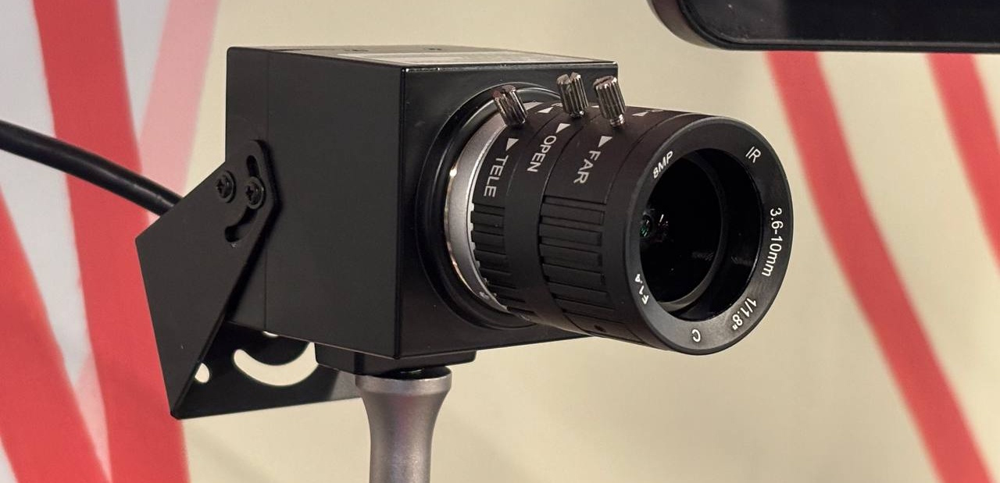
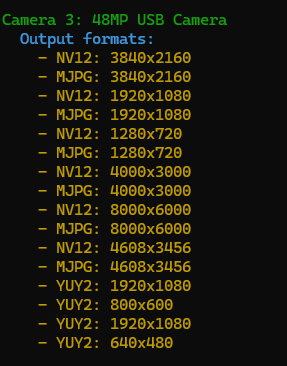

# camera-info

Visual Studio C++ console app that uses Media Foundation to enumerate connected cameras,
list output formats and resolutions, and print details to `std::wcout` with ANSI color codes.

# Background Story

I purchased a 48-megapixel USB camera for timelapse photography. I had already used other cameras 
from the company and trusted this camera to work out well (it has!). When I went to leave a review 
about the camera, I found that others had left bad reviews because they were unable to achieve the
stated resolution of 48-megapixels. In looking into this further, I found that some software either
simply doesn't support this resolution or does not support one of the pixel encodings (MJPG or NV12)
needed to get to this resolution. The camera supports a third pixel format, YUV2, for which it does
not produce videos at 48MP. 

Rather than view this as a binary "The camera does or does not support this resolution" it may be more
meaningful to work from the question of "Under what conditions does the camera achieve its maximum 
resolution." There are other attributes about a camera we might be interest in (like framerate), but
let's keep this simple. 

# Signed Binaries

Signed binaries for this application are included in this repository. You will find them in the 
[bin](bin) folder. Within there are two subfolders for an [ARM64 version](bin/release-arm64) version 
of the application and an [Intel Architecture x64](bin/release-x64) version of the build. I have not
tested the ARM version. I am making it available since it appears that Windows on ARM may be more common 
in the common years and the effort to produce an ARM binary now is next to nothing. 

From [J2i.net, LLC](https://j2i.net), 2026
